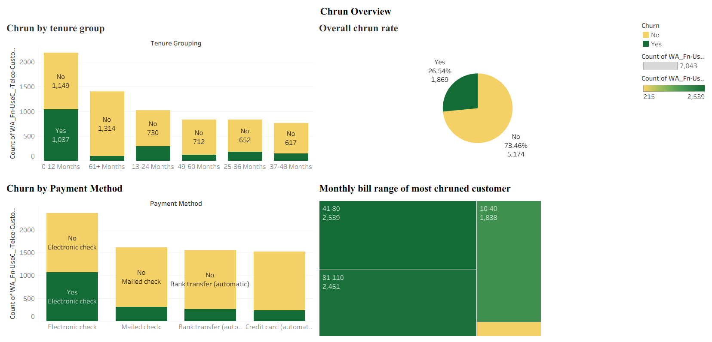
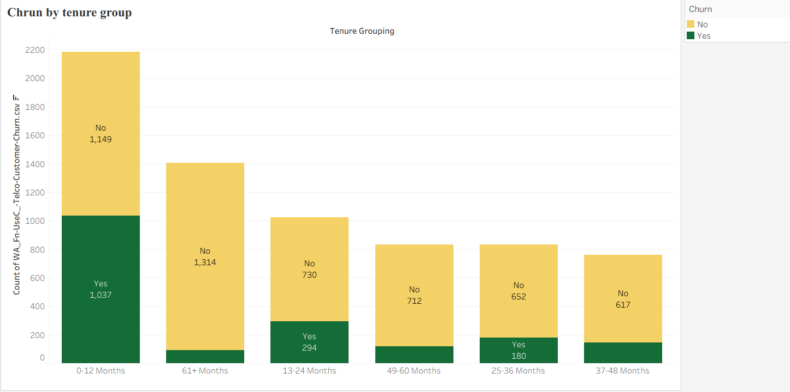
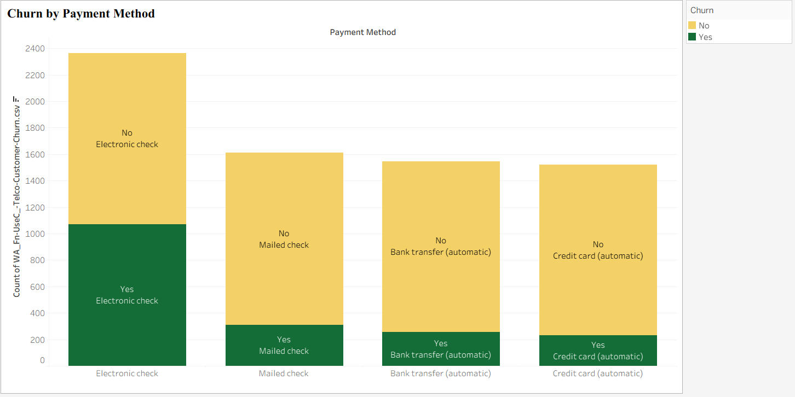
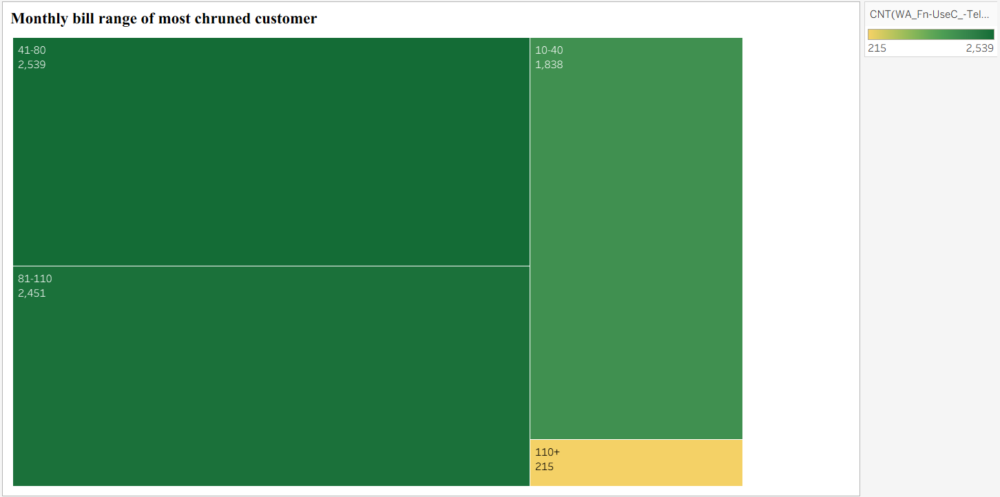
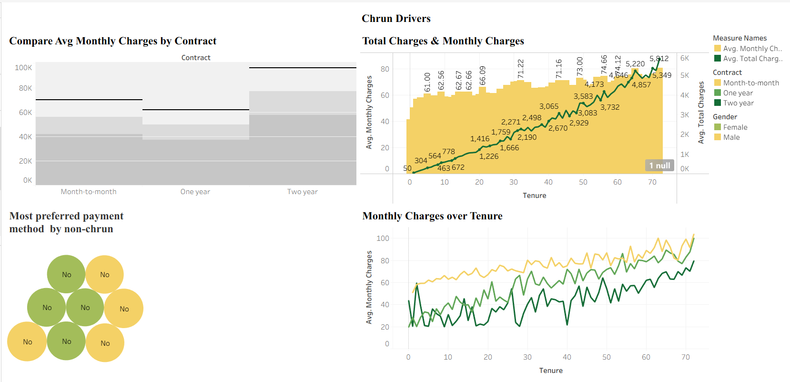
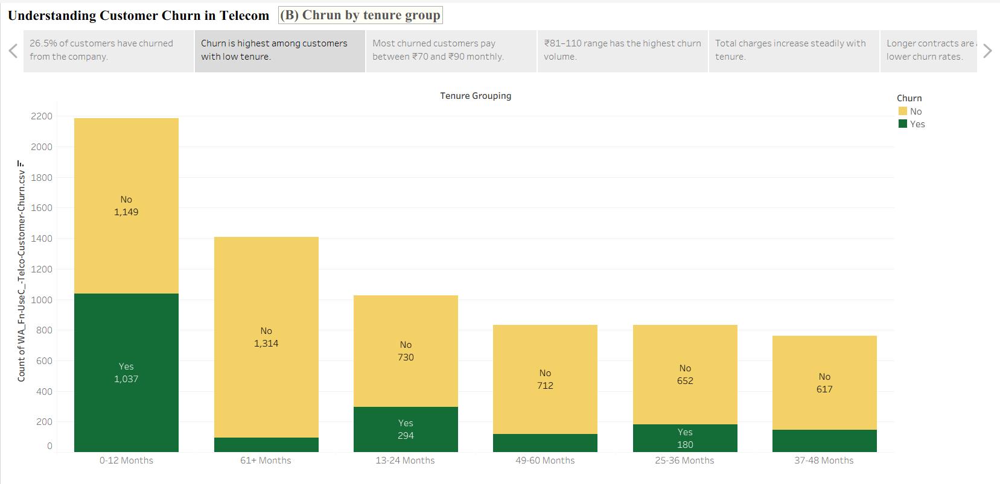

# Telecom Customer Churn Analysis Dashboard

## Project Overview

This Tableau project analyzes customer churn behavior in a telecom company and identifies the key factors influencing customer attrition.

The dashboard provides insights into customer demographics, contract types, payment methods, tenure, monthly charges, internet services, and churn trends to support customer retention strategies.

---

## Business Problem

Customer churn directly impacts revenue and business growth. Understanding why customers leave helps organizations design targeted retention programs and improve customer satisfaction.

This project aims to answer:

- What is the overall churn rate?
- Which customer groups are most likely to churn?
- How does tenure affect churn?
- Which payment methods are associated with higher churn?
- How do monthly charges influence churn?
- Which internet services have the highest churn risk?

---

## Tools Used

- Tableau Desktop
- Data Visualization
- Calculated Fields
- Storytelling Dashboard
- Interactive Charts
- Business Analytics

---

## Dataset

The dataset contains telecom customer information including:

- Customer Demographics
- Gender
- Tenure
- Contract Type
- Monthly Charges
- Total Charges
- Payment Method
- Internet Service
- Phone Service
- Churn Status

---

## Dashboard Pages

### 1. Churn Overview

Provides a high-level view of customer churn.

**Key Findings:**
- Total Customers: 7,043
- Churned Customers: 1,869
- Overall Churn Rate: 26.54%

---

### 2. Churn by Tenure Group

Analyzes churn across customer tenure segments.

**Insight:**
- Customers with 0–12 months tenure have the highest churn volume.
- Long-term customers show lower churn behavior.

---

### 3. Churn by Payment Method

Examines customer churn based on payment methods.

**Insight:**
- Electronic Check users show higher churn compared to other payment methods.
- Automatic payment methods are associated with lower churn.

---

### 4. Monthly Bill Range Analysis

Analyzes churn distribution across monthly charge ranges.

**Insight:**
- Most churned customers fall within the ₹41–80 and ₹81–110 monthly bill ranges.

---

### 5. Internet Service Analysis

Compares average monthly charges across internet service categories.

**Insight:**
- Fiber Optic customers have the highest average monthly charges and higher churn risk.

---

### 6. Contract Analysis

Compares customer charges by contract type.

**Insight:**
- Month-to-month customers exhibit higher churn.
- Longer contracts show better customer retention.

---

### 7. Churn Drivers Dashboard

Combines multiple visualizations to identify the strongest churn drivers.

Key factors include:
- Short customer tenure
- High monthly charges
- Month-to-month contracts
- Electronic check payments
- Fiber optic internet service

---

## Key Business Insights

### Customer Retention

- Churn rate is approximately 26.5%.
- New customers are more likely to leave.

### Contract Impact

- Longer contracts significantly reduce churn.

### Payment Behavior

- Customers using automatic payment methods are more loyal.

### Pricing Impact

- Higher monthly charges correlate with increased churn risk.

### Service Impact

- Fiber optic customers contribute a significant portion of churn.

---

## Skills Demonstrated

- Data Cleaning
- Data Analysis
- Business Intelligence
- Tableau Dashboard Development
- Data Storytelling
- Customer Segmentation
- KPI Analysis
- Churn Analytics
- Insight Generation

---

## Project Screenshots

### Churn Overview

### Churn by Tenure Group

### Churn by Payment Method

### Monthly Bill Range Analysis

### Churn Drivers

### Tableau Story

---

## Business Value

This dashboard helps telecom companies:

- Identify customers at risk of churn
- Improve customer retention strategies
- Optimize contract offerings
- Design targeted marketing campaigns
- Reduce revenue loss due to customer attrition

---

## Author

**Ramya R**

Data Analyst | Python | SQL | Tableau | Power BI | Machine Learning

GitHub: https://github.com/ramya-ravikumar-r

LinkedIn: https://www.linkedin.com/in/ramya-r1811/
